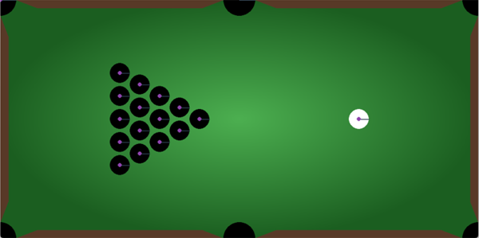

# Pool-Simulation
A simulation of a single player generic Pool game based on the pymunk physics engine, where the goal is to pocket all of the balls on the board.

Introduces a random agent which optimizes its moves by performing Gradient Descent on a cost function.

